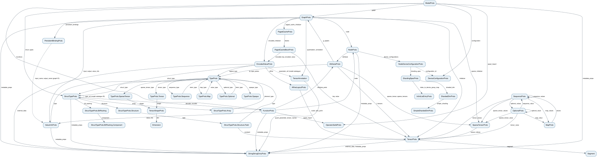

======
protos
======

Relations between protos
========================

The following graph shows containment relations between ONNX protos.
Each edge label is the attribute name (or names) that carries the nested proto.
The SVG below is generated from
:download:`protos_relations.dot <_static/protos_relations.dot>` with
``dot -Tsvg`` (Graphviz); regenerate it after editing the ``.dot`` source.

Containment attributes
======================

Quick attribute list used in the graph:

* ``ModelProto``: ``graph``, ``opset_import``, ``functions``, ``configuration``, ``metadata_props``
* ``GraphProto``: ``node``, ``initializer``, ``sparse_initializer``, ``input``, ``output``, ``value_info``, ``quantization_annotation``, ``metadata_props``
* ``FunctionProto``: ``attribute_proto``, ``node``, ``opset_import``, ``value_info``, ``metadata_props``
* ``NodeProto``: ``attribute``, ``device_configurations``, ``metadata_props``
* ``NodeDeviceConfigurationProto``: ``sharding_spec`` (and ``configuration_id``, a name reference to a ``DeviceConfigurationProto`` declared in ``ModelProto.configuration``)
* ``ShardingSpecProto``: ``index_to_device_group_map``, ``sharded_dim``
* ``ShardedDimProto``: ``simple_sharding``
* ``ValueInfoProto``: ``type``, ``metadata_props``
* ``TensorShapeProto``: ``dim``
* ``TypeProto``: ``tensor_type`` (``TypeProto.Tensor``), ``sparse_tensor_type`` (``TypeProto.SparseTensor``), ``sequence_type`` (``TypeProto.Sequence``), ``map_type`` (``TypeProto.Map``), ``optional_type`` (``TypeProto.Optional``)
* ``TypeProto.Tensor`` / ``TypeProto.SparseTensor``: ``shape`` (a ``TensorShapeProto``)
* ``TypeProto.Sequence`` / ``TypeProto.Optional``: ``elem_type`` (a ``TypeProto``)
* ``TypeProto.Map``: ``value_type`` (a ``TypeProto``)
* ``TensorProto``: ``segment``, ``external_data``, ``metadata_props``
* ``SparseTensorProto``: ``values``, ``indices``
* ``AttributeProto``: ``t``, ``tensors``, ``g``, ``graphs``, ``sparse_tensor``, ``sparse_tensors``, ``tp``, ``type_protos``
* ``TensorAnnotation``: ``quant_parameter_tensor_names``
* ``SequenceProto``: ``tensor_values``, ``sparse_tensor_values``, ``sequence_values``, ``map_values``, ``optional_values``
* ``MapProto``: ``values``
* ``OptionalProto``: ``tensor_value``, ``sparse_tensor_value``, ``sequence_value``, ``map_value``, ``optional_value``

.. toctree::
    :maxdepth: 1

    attribute_proto
    device_configuration_proto
    function_proto
    graph_proto
    int_int_list_entry_proto
    map_proto
    message
    model_proto
    node_device_configuration_proto
    node_proto
    operator_set_id_proto
    operator_status
    optional_proto
    sequence_proto
    sharded_dim_proto
    sharding_spec_proto
    simple_sharded_dim_proto
    sparse_tensor_proto
    string_string_entry_proto
    tensor_annotation
    tensor_proto
    tensor_shape_proto
    type_proto
    value_info_proto
