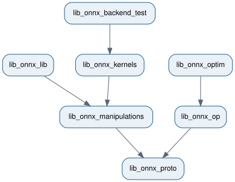

.. _l-design-library-split:

How the C++ libraries are split
===============================

*onnx-light* is split into small C++ libraries so consumers link only the
features they use. Parsing a model does not require schemas, shape inference,
kernels, or backend tests.

The dependency graph below points from each library to its dependencies. It is
generated from :download:`library_split.dot <../_static/library_split.dot>` with
``dot -Tsvg``.

The base dependency is ``lib_onnx_proto``::

    lib_onnx_proto
        └── lib_onnx_core
                ├── lib_onnx_op
                ├── lib_onnx_shape
                ├── lib_onnx_patterns
                ├── lib_onnx_kernels
                │       └── lib_onnx_backend_test
                ├── lib_onnx_gradient
                └── lib_onnx_manipulations
                        └── lib_onnx_lib

``lib_onnx_core`` contains the shared mechanisms used by the extension
libraries: graph helpers, symbolic expressions, the graph builder and pattern
optimizer, runtime execution machinery, and empty dispatch registries.
Concrete schemas, shape functions, patterns, and kernels are registered by
their sibling libraries, so none needs to depend on another extension.

Summary of each library
-----------------------

* ``onnx_light::lib_onnx_proto`` — proto-compatible message types, binary
  parsing and serialization, external data, and encrypted files.
* ``onnx_light::lib_onnx_core`` — graph and symbolic-shape utilities,
  ``GraphBuilder``, generic pattern optimization, runtime execution, and
  extension registries.
* ``onnx_light::lib_onnx_op`` — lightweight ONNX operator schemas without
  full checker or shape-inference support.
* ``onnx_light::lib_onnx_manipulations`` — text parser/printer, composition,
  and schema-independent model, attribute, and tensor helpers.
* ``onnx_light::lib_onnx_lib`` — the complete ONNX-compatible schemas,
  checker, inliner, shape inference, and version converter.
* ``onnx_light::lib_onnx_shape`` — concrete shape-inference and peak-memory
  functions.
* ``onnx_light::lib_onnx_patterns`` — concrete ONNX graph-rewriting patterns.
* ``onnx_light::lib_onnx_kernels`` — reference runtime kernels.
* ``onnx_light::lib_onnx_backend_test`` — generated backend-test cases and
  their registry.
* ``onnx_light::lib_onnx_gradient`` — reverse-mode gradient generation.

The last three targets are available only when
``ONNX_LIGHT_BUILD_KERNELS=ON``. With Python enabled, the libraries are shared
so all nanobind modules use the same C++ types; pure C++ builds use static
libraries.

Extension registration
----------------------

The core library owns registries but does not register concrete ONNX
implementations. Applications select extensions explicitly:

.. code-block:: cpp

    onnx_light::onnx_shapes::RegisterShapeFunctions();
    onnx_light::onnx_shapes::RegisterPeakMemoryFunctions();
    onnx_light::onnx_kernels::RegisterKernelFunctions();
    onnx_light::onnx_patterns::RegisterPatterns();

This keeps linking predictable: an application that does not evaluate models,
infer shapes, estimate peak memory, or optimize graphs does not pull in those
implementations.

What to link
------------

* **Read and write ONNX models** — ``onnx_light::lib_onnx_proto``.
* **Inspect lightweight operator schemas** — ``onnx_light::lib_onnx_op``.
* **Parse or print ONNX text and manipulate protos** —
  ``onnx_light::lib_onnx_manipulations``.
* **Use the full checker/schema/version-converter stack** —
  ``onnx_light::lib_onnx_lib``.
* **Infer shapes or estimate peak memory** —
  ``onnx_light::lib_onnx_shape``.
* **Run standard graph rewrites** — ``onnx_light::lib_onnx_patterns``.
* **Evaluate models with reference kernels** —
  ``onnx_light::lib_onnx_kernels``.
* **Collect and run backend tests** —
  ``onnx_light::lib_onnx_backend_test``.
* **Generate gradient functions** — ``onnx_light::lib_onnx_gradient``.

Public dependencies are propagated by CMake. A consumer normally names only
the highest-level target it needs. All installed targets use the
``onnx_light::`` namespace and are loaded with ``find_package(onnx_light
CONFIG REQUIRED)``; see :ref:`l-design-cpp-linking`.
