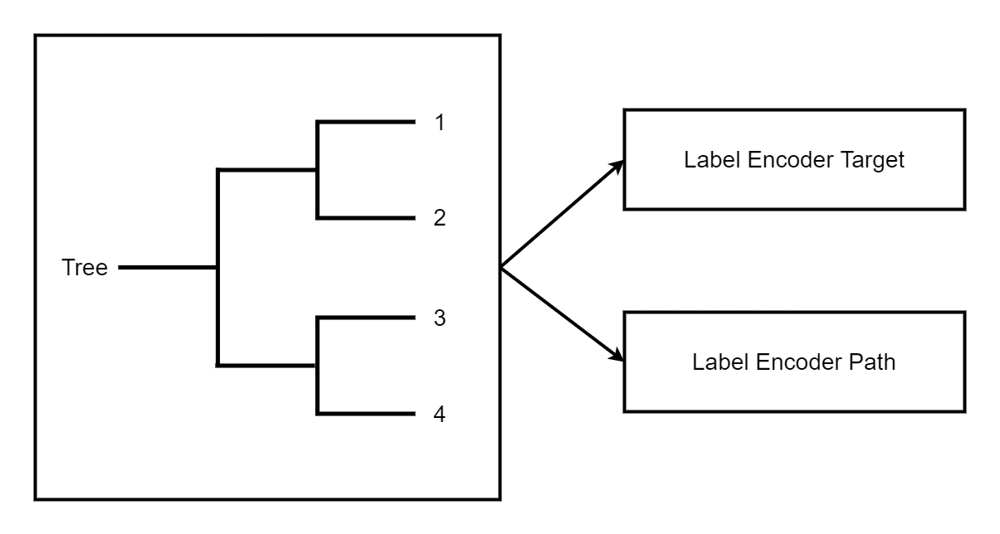

==========
Converters
==========

Using ONNX in production means the prediction function of a model can be
implemented with ONNX operators. A runtime must be chosen, one available
on the platform the model is deployed on. Discrepancies are checked and
finally the latency is measured. The first step of the model conversion
can be easy if there exists a converting library for this framework
supporting all the pieces of the model. If it is not the case, the missing
parts must be implemented in ONNX. That may be very time consuming.

What is a converting library?
=============================

`sklearn-onnx <https://onnx.ai/sklearn-onnx/>`_ converts
`scikit-learn <https://scikit-learn.org/stable/>`_ models into ONNX. It
rewrites the prediction function of a model, whatever it is, with ONNX
operators using the API introduced in :doc:`python`. It ensures that the
predictions are equal or at least very close to the expected predictions
computed with the original model.

Machine learning libraries usually have their own design. That's why there
exists a specific converting library for each of them. Many of them are
listed there:
`Converting to ONNX format
<https://github.com/onnx/tutorials#converting-to-onnx-format>`_.
Here is a short list:

* `sklearn-onnx <https://onnx.ai/sklearn-onnx/>`_:
  converts models from `scikit-learn <https://scikit-learn.org/stable/>`_;
* `tensorflow-onnx <https://github.com/onnx/tensorflow-onnx>`_:
  converts models from `tensorflow <https://www.tensorflow.org/>`_;
* `onnxmltools <https://github.com/onnx/onnxmltools>`_:
  converts models from `lightgbm <https://lightgbm.readthedocs.io/>`_,
  `xgboost <https://xgboost.readthedocs.io/en/stable/>`_,
  `pyspark <https://spark.apache.org/docs/latest/api/python/>`_,
  `libsvm <https://github.com/cjlin1/libsvm>`_;
* `torch.onnx <https://pytorch.org/docs/master/onnx.html>`_:
  converts models from `pytorch <https://pytorch.org/>`_.

The main challenge for all these libraries is to keep up the rhythm. They
must be updated every time ONNX or the library they support has a new
released version. That means three to five new releases per year.

Converting libraries are not compatible among each other.
`tensorflow-onnx <https://github.com/onnx/tensorflow-onnx>`_ is dedicated
to tensorflow and only tensorflow. The same goes for sklearn-onnx
specialized in scikit-learn.

One challenge is customization. It is difficult to support custom pieces
in a machine-learned model. The user must write a specific converter for
this piece. Somehow, it is like implementing the prediction function
twice. There is one easy case: deep learning frameworks have their own
primitives to ensure the same code can be executed on different
environments. As long as a custom layer or a subpart is using pieces of
pytorch or tensorflow, there is not much to do. It is a different story
for scikit-learn. This package does not have its own addition or
multiplication, it relies on numpy or scipy. The user must implement
their transformer or predictor with ONNX primitives, whether or not it was
implemented with numpy.

Where does ``onnx-light`` fit in?
---------------------------------

``onnx-light`` is **not** a converter from a machine-learning framework to
ONNX. It is a drop-in replacement for the ``onnx`` package focused on
loading, saving, checking, shape inference and a small reference runtime
for ONNX models. Converters such as ``sklearn-onnx``, ``tensorflow-onnx``,
``onnxmltools`` or ``torch.onnx`` produce a ``ModelProto`` (or a
serialized blob) which can then be consumed by ``onnx-light`` for further
processing — typically when the resulting model exceeds the 2 GB protobuf
limit or needs to be loaded with multiple threads, in zero-copy mode, or
with AES-256 encryption (see :ref:`l-design-loading-saving-scenarios`).

Alternatives
============

One alternative for implementing ONNX export capability is to leverage
standard protocols such as the
`Array API standard <https://data-apis.org/array-api/latest/>`_, which
standardizes a common set of array operations. It enables code reuse
across libraries like NumPy, JAX, PyTorch, CuPy and more.
`ndonnx <https://github.com/Quantco/ndonnx>`_ enables execution with an
ONNX backend and instant ONNX export for Array API compliant code. This
diminishes the need for dedicated converter library code since the same
code used to implement most of a library can be reused in ONNX
conversion. It also provides a convenient primitive for converter authors
looking for a NumPy-like experience when constructing ONNX graphs.

Opsets
======

ONNX releases packages with version numbers like ``major.minor.fix``.
Every minor update means the list of operators is different or the
signature has changed. It is also associated to an opset, version
``1.10`` is opset 15, ``1.11`` is opset 16. Every ONNX graph should
define the opset it follows. Changing this version without updating the
operators could make the graph invalid. If the opset is left unspecified,
ONNX will consider that the graph is valid for the latest opset.

New opsets usually introduce new operators. The same inference function
could be implemented differently, usually in a more efficient way.
However, the runtime the model is running on may not support the newest
opsets, or at least not in the installed version. That's why every
converting library offers the possibility to create an ONNX graph for a
specific opset usually called ``target_opset``. The ONNX language
describes simple and complex operators. Changing the opset is similar to
upgrading a library: ``onnx`` and ONNX runtimes must support backward
compatibility.

Other API
=========

Examples in :doc:`python` show that the onnx API is very verbose. It is
also difficult to get a whole picture of a graph by reading the code
unless it is a small one. Almost every converting library has implemented
a different API to create a graph, usually more simple, less verbose
than the API of the ``onnx`` package. All these APIs automate the
addition of initializers, hide the creation of a name for every
intermediate result, and deal with different versions for different
opsets.

A class Graph with a method add_node
------------------------------------

``tensorflow-onnx`` implements a class graph. It rewrites tensorflow
functions with ONNX operators when ONNX does not have a similar function
(see `Erf <https://github.com/onnx/tensorflow-onnx/blob/master/tf2onnx/onnx_opset/math.py#L414>`_).

sklearn-onnx defines two different APIs. The first one introduced in
that example
`Implement a converter
<https://onnx.ai/sklearn-onnx/auto_tutorial/plot_jcustom_syntax.html>`_
follows a similar design as tensorflow-onnx. The following lines are
extracted from the converter of a linear classifier.

.. code-block:: python

    # initializer

    coef = scope.get_unique_variable_name('coef')
    model_coef = np.array(
        classifier_attrs['coefficients'], dtype=np.float64)
    model_coef = model_coef.reshape((number_of_classes, -1)).T
    container.add_initializer(
        coef, proto_dtype, model_coef.shape, model_coef.ravel().tolist())

    intercept = scope.get_unique_variable_name('intercept')
    model_intercept = np.array(
        classifier_attrs['intercepts'], dtype=np.float64)
    model_intercept = model_intercept.reshape((number_of_classes, -1)).T
    container.add_initializer(
        intercept, proto_dtype, model_intercept.shape,
        model_intercept.ravel().tolist())

    # add nodes

    multiplied = scope.get_unique_variable_name('multiplied')
    container.add_node(
        'MatMul', [operator.inputs[0].full_name, coef], multiplied,
        name=scope.get_unique_operator_name('MatMul'))

    # [...]

    argmax_output_name = scope.get_unique_variable_name('label')
    container.add_node('ArgMax', raw_score_name, argmax_output_name,
                       name=scope.get_unique_operator_name('ArgMax'),
                       axis=1)

Operator as function
--------------------

The second API shown in
`Implement a new converter
<https://onnx.ai/sklearn-onnx/auto_tutorial/plot_icustom_converter.html>`_
is more compact and defines every ONNX operator as composable functions.
The syntax looks like this for
`KMeans
<https://scikit-learn.org/stable/modules/generated/sklearn.cluster.KMeans.html>`_,
less verbose and easier to read.

.. code-block:: python

    rs = OnnxReduceSumSquare(
        input_name, axes=[1], keepdims=1, op_version=opv)

    gemm_out = OnnxMatMul(
        input_name, (C.T * (-2)).astype(dtype), op_version=opv)

    z = OnnxAdd(rs, gemm_out, op_version=opv)
    y2 = OnnxAdd(C2, z, op_version=opv)
    ll = OnnxArgMin(y2, axis=1, keepdims=0, output_names=out[:1],
                    op_version=opv)
    y2s = OnnxSqrt(y2, output_names=out[1:], op_version=opv)

Tricks learned from experience
==============================

Discrepancies
-------------

ONNX is strongly typed and optimizes for ``float32``, the most common
type in deep learning. Libraries in standard machine learning use both
``float32`` and ``float64``. ``numpy`` usually casts to the most generic
type, ``float64``. It has no significant impact when the prediction
function is contiguous. When it is not, the right type must be used.
Example
`Issues when switching to float
<https://onnx.ai/sklearn-onnx/auto_tutorial/plot_ebegin_float_double.html>`_
gives more insights on that topic.

Parallelization changes the order of computation. It is usually not
significant but it may explain some weird discrepancies.
``1 + 1e17 - 1e17 = 0`` but ``1e17 - 1e17 + 1 = 1``. High orders of
magnitude are rare but not so rare when a model uses the inverse of a
matrix.

IsolationForest Trick
---------------------

ONNX only implements a *TreeEnsembleRegressor* but it does not offer the
possibility to retrieve any information about the path the decision
followed or statistics about the graph. The trick is to use one forest to
predict the leaf index and map this leaf index one or multiple times with
the information needed.

Discretization
--------------

Looking in which interval a feature falls. That's easy to do with numpy
but not so easy to do efficiently with ONNX. The fastest way is to use a
TreeEnsembleRegressor, a binary search, which outputs the interval index.
That's what this example implements:
`Converter for WOE
<https://onnx.ai/sklearn-onnx/auto_tutorial/plot_woe_transformer.html>`_.

Contribute
----------

The `onnx repository <https://github.com/onnx/onnx>`_ must be forked and
cloned to contribute to ONNX itself. To contribute to ``onnx-light``,
fork and clone the
`onnx-light repository <https://github.com/xadupre/onnx-light>`_ instead
and follow :ref:`l-howto-install-onnx-light`.
