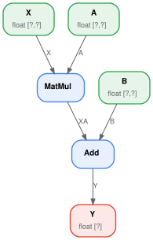
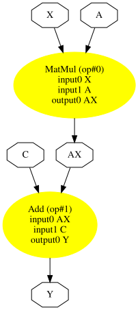
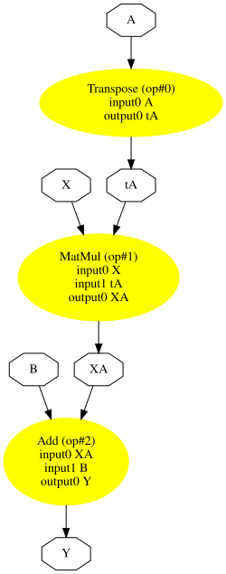
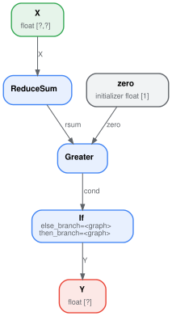
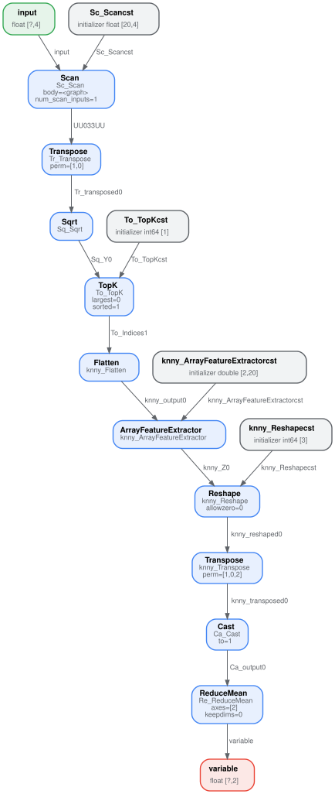
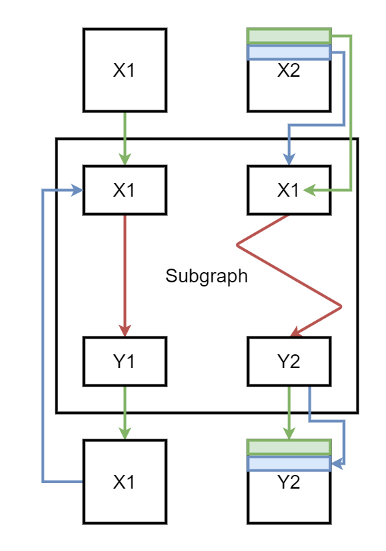

================
ONNX with Python
================

.. tip::

    The pages on this site illustrate how to use ``onnx-light`` to inspect
    and manipulate ONNX models. The same examples can be ported back to
    the standard ``onnx`` package by replacing ``onnx_light.onnx_lib``
    with ``onnx`` in every ``import``. The
    `ir-py project <https://github.com/onnx/ir-py>`_ provides yet another
    set of Python APIs for creating and manipulating ONNX models, with a
    more modern and ergonomic interface compared to the APIs described here.

The next sections highlight the main functions used to build an ONNX
graph with the Python API ``onnx-light`` exposes through
:mod:`onnx_light.onnx_lib`.

.. _l-onnx-linear-regression-onnx-api:

A simple example: a linear regression
=====================================

The linear regression is the simplest model in machine learning, described
by the expression :math:`Y = XA + B`. We can see it as a function of three
variables :math:`Y = f(X, A, B)` decomposed into ``y = Add(MatMul(X, A),
B)``. That's what we need to represent with ONNX operators. The first
thing is to implement a function with ONNX operators. ONNX is strongly
typed: shape and type must be defined for both inputs and outputs of the
function. We need four functions to build the graph:

* ``make_tensor_value_info``: declares a variable (input or output)
  given its shape and type;
* ``make_node``: creates a node defined by an operation (an operator
  type), its inputs and outputs;
* ``make_graph``: a function to create an ONNX graph with the objects
  created by the two previous functions;
* ``make_model``: a last function which merges the graph and additional
  metadata.

All along the creation, we need to give a name to every input, output of
every node of the graph. Inputs and outputs of the graph are defined by
ONNX objects, strings are used to refer to intermediate results. This is
how it looks like.

.. runpython::
    :showcode:

    # imports

    from onnx_light.onnx_lib import TensorProto
    from onnx_light.onnx_lib.helper import (
        make_model, make_node, make_graph,
        make_tensor_value_info)
    from onnx_light.onnx_lib.checker import check_model

    # inputs

    # 'X' is the name, TensorProto.FLOAT the type, [None, None] the shape
    X = make_tensor_value_info('X', TensorProto.FLOAT, [None, None])
    A = make_tensor_value_info('A', TensorProto.FLOAT, [None, None])
    B = make_tensor_value_info('B', TensorProto.FLOAT, [None, None])

    # outputs, the shape is left undefined

    Y = make_tensor_value_info('Y', TensorProto.FLOAT, [None])

    # nodes

    # It creates a node defined by the operator type MatMul,
    # 'X', 'A' are the inputs of the node, 'XA' the output.
    node1 = make_node('MatMul', ['X', 'A'], ['XA'])
    node2 = make_node('Add', ['XA', 'B'], ['Y'])

    # from nodes to graph
    # the graph is built from the list of nodes, the list of inputs,
    # the list of outputs and a name.

    graph = make_graph([node1, node2],  # nodes
                        'lr',  # a name
                        [X, A, B],  # inputs
                        [Y])  # outputs

    # onnx graph
    # there is no metadata in this case.

    onnx_model = make_model(graph)

    # Let's check the model is consistent,
    # this function is described in section
    # Checker and Shape Inference.
    check_model(onnx_model)

    # the work is done, let's display it...
    print(onnx_model)

An empty shape (``None``) means any shape, a shape defined as
``[None, None]`` tells this object is a tensor with two dimensions
without any further precision. The ONNX graph can also be inspected by
looking into the fields of each object of the graph.

.. runpython::
    :showcode:

    from onnx_light.onnx_lib import TensorProto
    from onnx_light.onnx_lib.helper import (
        make_model, make_node, make_graph,
        make_tensor_value_info)
    from onnx_light.onnx_lib.checker import check_model

    def shape2tuple(shape):
        return tuple(getattr(d, 'dim_value', 0) for d in shape.dim)

    X = make_tensor_value_info('X', TensorProto.FLOAT, [None, None])
    A = make_tensor_value_info('A', TensorProto.FLOAT, [None, None])
    B = make_tensor_value_info('B', TensorProto.FLOAT, [None, None])
    Y = make_tensor_value_info('Y', TensorProto.FLOAT, [None])
    node1 = make_node('MatMul', ['X', 'A'], ['XA'])
    node2 = make_node('Add', ['XA', 'B'], ['Y'])
    graph = make_graph([node1, node2], 'lr', [X, A, B], [Y])
    onnx_model = make_model(graph)
    check_model(onnx_model)

    # the list of inputs
    print('** inputs **')
    print(onnx_model.graph.input)

    # in a more nicely format
    print('** inputs **')
    for obj in onnx_model.graph.input:
        print("name=%r dtype=%r shape=%r" % (
            obj.name, obj.type.tensor_type.elem_type,
            shape2tuple(obj.type.tensor_type.shape)))

    # the list of outputs
    print('** outputs **')
    print(onnx_model.graph.output)

    # in a more nicely format
    print('** outputs **')
    for obj in onnx_model.graph.output:
        print("name=%r dtype=%r shape=%r" % (
            obj.name, obj.type.tensor_type.elem_type,
            shape2tuple(obj.type.tensor_type.shape)))

    # the list of nodes
    print('** nodes **')
    print(onnx_model.graph.node)

    # in a more nicely format
    print('** nodes **')
    for node in onnx_model.graph.node:
        print("name=%r type=%r input=%r output=%r" % (
            node.name, node.op_type, node.input, node.output))

The tensor type is an integer value (=1 for ``FLOAT``). The helper
function :func:`onnx_light.onnx_lib.helper.tensor_dtype_to_np_dtype`
converts the integer to its corresponding numpy data type (``float32``
for 1).

.. runpython::
    :showcode:

    from onnx_light.onnx_lib import TensorProto
    from onnx_light.onnx_lib.helper import tensor_dtype_to_np_dtype

    np_dtype = tensor_dtype_to_np_dtype(TensorProto.FLOAT)
    print(f"The converted numpy dtype for TensorProto.FLOAT is {np_dtype}.")

Serialization
=============

onnx-light adds the necessary definitions to
describe a machine learning model and most of the time, ONNX is used to
serialize or deserialize a model. The first section addresses this need.
The second section introduces the serialization and deserialization of
data such as tensors, sparse tensors...

Model Serialization
-------------------

The model needs to be saved to be deployed. It
minimizes the space needed to save the graph on disk. Every object in
``onnx`` can be serialized with method ``SerializeToString``. That's also
the case for the whole model.

.. runpython::
    :showcode:

    from onnx_light.onnx_lib import TensorProto
    from onnx_light.onnx_lib.helper import (
        make_model, make_node, make_graph,
        make_tensor_value_info)
    from onnx_light.onnx_lib.checker import check_model

    X = make_tensor_value_info('X', TensorProto.FLOAT, [None, None])
    A = make_tensor_value_info('A', TensorProto.FLOAT, [None, None])
    B = make_tensor_value_info('B', TensorProto.FLOAT, [None, None])
    Y = make_tensor_value_info('Y', TensorProto.FLOAT, [None])
    node1 = make_node('MatMul', ['X', 'A'], ['XA'])
    node2 = make_node('Add', ['XA', 'B'], ['Y'])
    graph = make_graph([node1, node2], 'lr', [X, A, B], [Y])
    onnx_model = make_model(graph)
    check_model(onnx_model)

    # The serialization
    with open("linear_regression.onnx", "wb") as f:
        f.write(onnx_model.SerializeToString())

    # display
    print(onnx_model)

The graph can be restored with function ``load``. ``onnx-light`` exposes
its own loader at :func:`onnx_light.onnx.load` (which supports parallel
tensor parsing, zero-copy buffers and external data; see
:ref:`l-design-loading-saving-scenarios`).

.. runpython::
    :showcode:

    from onnx_light.onnx import load

    onnx_model = load("linear_regression.onnx")

    # display
    print(onnx_model)

It looks exactly the same. With the standard ``onnx`` package, any model
can be serialized this way unless they are bigger than 2 GB: protobuf is
limited to messages smaller than this threshold. ``onnx-light`` lifts
that limit because it does not rely on the protobuf C++ runtime — see
:ref:`l-design-protobuf-format` for details.

Data Serialization
------------------

The serialization of tensors usually happens like the following:

.. runpython::
    :showcode:

    import numpy
    from onnx_light.onnx_lib.numpy_helper import from_array

    numpy_tensor = numpy.array([0, 1, 4, 5, 3], dtype=numpy.float32)
    print(type(numpy_tensor))

    onnx_tensor = from_array(numpy_tensor)
    print(type(onnx_tensor))

    serialized_tensor = onnx_tensor.SerializeToString()
    print(type(serialized_tensor))

    with open("saved_tensor.pb", "wb") as f:
        f.write(serialized_tensor)

And the deserialization like:

.. runpython::
    :showcode:

    from onnx_light.onnx_lib import TensorProto
    from onnx_light.onnx_lib.numpy_helper import to_array

    with open("saved_tensor.pb", "rb") as f:
        serialized_tensor = f.read()
    print(type(serialized_tensor))

    onnx_tensor = TensorProto()
    onnx_tensor.ParseFromString(serialized_tensor)
    print(type(onnx_tensor))

    numpy_tensor = to_array(onnx_tensor)
    print(numpy_tensor)

The same schema can be used for any of the ``*Proto`` message types:

.. runpython::
    :showcode:

    import pprint
    from onnx_light import onnx_lib
    pprint.pprint([p for p in dir(onnx_lib)
                   if p.endswith('Proto') and p[0] != '_'])

.. _l-onnx-linear-regression-onnx-api-init:

Initializer, default value
==========================

The previous model assumed the coefficients of the linear regression
were also inputs of the model. That's not very convenient. They should be
part of the model itself as constants or **initializers** to follow ONNX
semantics. The next example modifies the previous one to change inputs
``A`` and ``B`` into initializers. The package implements two functions
to convert from numpy into onnx and the other way around.

* ``onnx_light.onnx_lib.numpy_helper.to_array``: converts from onnx to
  numpy;
* ``onnx_light.onnx_lib.numpy_helper.from_array``: converts from numpy
  to onnx.

.. runpython::
    :showcode:

    import numpy
    from onnx_light.onnx_lib import numpy_helper, TensorProto
    from onnx_light.onnx_lib.helper import (
        make_model, make_node, make_graph,
        make_tensor_value_info)
    from onnx_light.onnx_lib.checker import check_model

    # initializers
    value = numpy.array([0.5, -0.6], dtype=numpy.float32)
    A = numpy_helper.from_array(value, name='A')

    value = numpy.array([0.4], dtype=numpy.float32)
    C = numpy_helper.from_array(value, name='C')

    # the part which does not change
    X = make_tensor_value_info('X', TensorProto.FLOAT, [None, None])
    Y = make_tensor_value_info('Y', TensorProto.FLOAT, [None])
    node1 = make_node('MatMul', ['X', 'A'], ['AX'])
    node2 = make_node('Add', ['AX', 'C'], ['Y'])
    graph = make_graph([node1, node2], 'lr', [X], [Y], [A, C])
    onnx_model = make_model(graph)
    check_model(onnx_model)

    print(onnx_model)

Again, it is possible to go through the onnx structure to check what the
initializers look like.

.. runpython::
    :showcode:

    import numpy
    from onnx_light.onnx_lib import numpy_helper, TensorProto
    from onnx_light.onnx_lib.helper import (
        make_model, make_node, make_graph,
        make_tensor_value_info)
    from onnx_light.onnx_lib.checker import check_model

    # initializers
    value = numpy.array([0.5, -0.6], dtype=numpy.float32)
    A = numpy_helper.from_array(value, name='A')

    value = numpy.array([0.4], dtype=numpy.float32)
    C = numpy_helper.from_array(value, name='C')

    # the part which does not change
    X = make_tensor_value_info('X', TensorProto.FLOAT, [None, None])
    Y = make_tensor_value_info('Y', TensorProto.FLOAT, [None])
    node1 = make_node('MatMul', ['X', 'A'], ['AX'])
    node2 = make_node('Add', ['AX', 'C'], ['Y'])
    graph = make_graph([node1, node2], 'lr', [X], [Y], [A, C])
    onnx_model = make_model(graph)
    check_model(onnx_model)

    print('** initializer **')
    for init in onnx_model.graph.initializer:
        print(init)

The type is defined as an integer as well, with the same meaning. In this
second example, there is only one input left. Inputs ``A`` and ``B`` were
removed. They could be kept; in that case, they are optional: every
initializer sharing the same name as an input is considered as a default
value. It replaces the input if the latter is not given.

Attributes
==========

Some operators need attributes such as the *Transpose* operator. Let's
build the graph for expression :math:`y = XA' + B` or
``y = Add(MatMul(X, Transpose(A)) + B)``. *Transpose* needs an attribute
defining the permutation of axes: ``perm=[1, 0]``. It is added as a
named attribute in function ``make_node``.

.. runpython::
    :showcode:

    from onnx_light.onnx_lib import TensorProto
    from onnx_light.onnx_lib.helper import (
        make_model, make_node, make_graph,
        make_tensor_value_info)
    from onnx_light.onnx_lib.checker import check_model

    # unchanged
    X = make_tensor_value_info('X', TensorProto.FLOAT, [None, None])
    A = make_tensor_value_info('A', TensorProto.FLOAT, [None, None])
    B = make_tensor_value_info('B', TensorProto.FLOAT, [None, None])
    Y = make_tensor_value_info('Y', TensorProto.FLOAT, [None])

    # added
    node_transpose = make_node('Transpose', ['A'], ['tA'], perm=[1, 0])

    # unchanged except A is replaced by tA
    node1 = make_node('MatMul', ['X', 'tA'], ['XA'])
    node2 = make_node('Add', ['XA', 'B'], ['Y'])

    # node_transpose is added to the list
    graph = make_graph([node_transpose, node1, node2],
                       'lr', [X, A, B], [Y])
    onnx_model = make_model(graph)
    check_model(onnx_model)

    # the work is done, let's display it...
    print(onnx_model)

The whole list of *make* functions is the following.

.. runpython::
    :showcode:

    import pprint
    from onnx_light.onnx_lib import helper
    pprint.pprint([k for k in dir(helper) if k.startswith('make')])

Opset and metadata
==================

Let's load the ONNX file previously created and check what kind of
metadata it has.

.. runpython::
    :showcode:

    from onnx_light.onnx import load

    onnx_model = load("linear_regression.onnx")

    for field in ['doc_string', 'domain', 'functions',
                  'ir_version', 'metadata_props', 'model_version',
                  'opset_import', 'producer_name', 'producer_version']:
        print(field, getattr(onnx_model, field))

Most of them are empty because they were not filled when the ONNX graph
was created. Two of them have a value:

.. runpython::
    :showcode:

    from onnx_light.onnx import load

    onnx_model = load("linear_regression.onnx")

    print("ir_version:", onnx_model.ir_version)
    for opset in onnx_model.opset_import:
        print("opset domain=%r version=%r" % (opset.domain, opset.version))

``IR`` defines the version of the ONNX language. Opset defines the version
of operators being used. Without any precision, ONNX uses the latest
version available coming from the installed package. Another one can be
used.

.. runpython::
    :showcode:

    from onnx_light.onnx import load

    onnx_model = load("linear_regression.onnx")

    del onnx_model.opset_import[:]
    opset = onnx_model.opset_import.add()
    opset.domain = ''
    opset.version = 14

    for opset in onnx_model.opset_import:
        print("opset domain=%r version=%r" % (opset.domain, opset.version))

Any opset can be used as long as all operators are defined the way ONNX
specifies them. Version 5 of operator *Reshape* defines the shape as an
input and not as an attribute like in version 1. The opset tells which
specifications is followed while describing the graph.

The other metadata can be used to store any information, to describe the
way the model was generated, or as a way to distinguish a model from
another with a version number.

.. runpython::
    :showcode:

    from onnx_light.onnx import load
    from onnx_light.onnx_lib import helper

    onnx_model = load("linear_regression.onnx")

    onnx_model.model_version = 15
    onnx_model.producer_name = "something"
    onnx_model.producer_version = "some other thing"
    onnx_model.doc_string = "documentation about this model"

    data = dict(key1="value1", key2="value2")
    helper.set_model_props(onnx_model, data)

    print(onnx_model)

Field ``training_info`` can be used to store additional graphs.

Subgraph: test and loops
========================

They are usually grouped in a category called *control flow*. It is
usually better to avoid them as they are not as efficient as matrix
operations, which are much faster and optimized.

If
--

A test can be implemented with operator *If*. It executes one subgraph or
another depending on one boolean. This is not used very often as a
function usually needs the result of many comparisons in a batch. The
following example computes the sum of all floats in a matrix and, based
on the sign, returns 1 or -1.

.. runpython::
    :showcode:

    import numpy
    from onnx_light import onnx_lib
    from onnx_light.onnx_lib.helper import (
        make_node, make_graph, make_model, make_tensor_value_info)
    from onnx_light.onnx_lib.numpy_helper import from_array
    from onnx_light.onnx_lib.checker import check_model

    # initializers
    value = numpy.array([0], dtype=numpy.float32)
    zero = from_array(value, name='zero')

    # Same as before, X is the input, Y is the output.
    X = make_tensor_value_info('X', onnx_lib.TensorProto.FLOAT, [None, None])
    Y = make_tensor_value_info('Y', onnx_lib.TensorProto.FLOAT, [None])

    # The node building the condition. The first one
    # sums over all axes.
    rsum = make_node('ReduceSum', ['X'], ['rsum'])
    # The second compares the result to 0.
    cond = make_node('Greater', ['rsum', 'zero'], ['cond'])

    # Builds the graph if the condition is True.
    # Input for then
    then_out = make_tensor_value_info(
        'then_out', onnx_lib.TensorProto.FLOAT, None)
    # The constant to return.
    then_cst = from_array(numpy.array([1]).astype(numpy.float32))

    # The only node.
    then_const_node = make_node(
        'Constant', inputs=[],
        outputs=['then_out'],
        value=then_cst, name='cst1')

    # And the graph wrapping these elements.
    then_body = make_graph(
        [then_const_node], 'then_body', [], [then_out])

    # Same process for the else branch.
    else_out = make_tensor_value_info(
        'else_out', onnx_lib.TensorProto.FLOAT, [5])
    else_cst = from_array(numpy.array([-1]).astype(numpy.float32))

    else_const_node = make_node(
        'Constant', inputs=[],
        outputs=['else_out'],
        value=else_cst, name='cst2')

    else_body = make_graph(
        [else_const_node], 'else_body',
        [], [else_out])

    # Finally the node If taking both graphs as attributes.
    if_node = make_node(
        'If', ['cond'], ['Y'],
        then_branch=then_body,
        else_branch=else_body)

    # The final graph.
    graph = make_graph([rsum, cond, if_node], 'if', [X], [Y], [zero])
    onnx_model = make_model(graph)
    check_model(onnx_model)

    # Let's freeze the opset.
    del onnx_model.opset_import[:]
    opset = onnx_model.opset_import.add()
    opset.domain = ''
    opset.version = 15
    onnx_model.ir_version = 8

    # Save.
    with open("onnx_if_sign.onnx", "wb") as f:
        f.write(onnx_model.SerializeToString())

    # Some display.
    print(onnx_model)

The whole is easier to visualize with the following image.

Both else and then branches are very simple. Node *If* could even be
replaced with a node *Where* and that would be faster. It becomes
interesting when both branches are bigger and skipping one is more
efficient.

Scan
----

*Scan* seems quite complex when reading the specifications. It is useful
to loop over one dimension of a tensor and store the results in a
preallocated tensor.

The following example implements a classic nearest neighbors for a
regression problem. The first step consists in computing the pairwise
distances between the input features *X* and the training set *W*:
:math:`dist(X,W) = (M_{ij}) = (\lVert X_i - W_j \rVert^2)_{ij}`. It is
followed by an operator *TopK* which extracts the *k* nearest neighbors.

.. runpython::
    :showcode:

    import numpy
    from onnx_light.onnx_lib import numpy_helper, TensorProto
    from onnx_light.onnx_lib.helper import (
        make_model, make_node, set_model_props, make_tensor, make_graph,
        make_tensor_value_info)
    from onnx_light.onnx_lib.checker import check_model

    # subgraph
    initializers = []
    nodes = []
    inputs = []
    outputs = []

    value = make_tensor_value_info('next_in', 1, [None, 4])
    inputs.append(value)
    value = make_tensor_value_info('next', 1, [None])
    inputs.append(value)

    value = make_tensor_value_info('next_out', 1, [None, None])
    outputs.append(value)
    value = make_tensor_value_info('scan_out', 1, [None])
    outputs.append(value)

    node = make_node(
        'Identity', ['next_in'], ['next_out'],
        name='cdistd_17_Identity', domain='')
    nodes.append(node)

    node = make_node(
        'Sub', ['next_in', 'next'], ['cdistdf_17_C0'],
        name='cdistdf_17_Sub', domain='')
    nodes.append(node)

    node = make_node(
        'ReduceSumSquare', ['cdistdf_17_C0'], ['cdistdf_17_reduced0'],
        name='cdistdf_17_ReduceSumSquare', axes=[1], keepdims=0, domain='')
    nodes.append(node)

    node = make_node(
        'Identity', ['cdistdf_17_reduced0'],
        ['scan_out'], name='cdistdf_17_Identity', domain='')
    nodes.append(node)

    graph = make_graph(nodes, 'OnnxIdentity',
                       inputs, outputs, initializers)

    # main graph

    initializers = []
    nodes = []
    inputs = []
    outputs = []

    opsets = {'': 15, 'ai.onnx.ml': 15}

    # initializers
    list_value = [
        23.29599822460675, -120.86516699239603, -144.70495899914215,
        -260.08772982740413, 154.65272105889147, -122.23295157108991,
        247.45232560871727, -182.83789715805776, -132.92727431421793,
        147.48710175784703, 88.27761768038069, -14.87785569894749,
        111.71487894705504, 301.0518319089629, -29.64235742280055,
        -113.78493504731911, -204.41218591022718, 112.26561056133608,
        66.04032954135549, -229.5428380626701, -33.549262642481615,
        -140.95737409864623, -87.8145187836131, -90.61397011283958,
        57.185488100413366, 56.864151796743855, 77.09054590340892,
        -187.72501631246712, -42.779503579806025, -21.642642730674076,
        -44.58517761667535, 78.56025104939847, -23.92423223842056,
        234.9166231927213, -73.73512816431007, -10.150864499514297,
        -70.37105466673813, 65.5755688281476, 108.68676290979731,
        -78.36748960443065]
    value = numpy.array(list_value, dtype=numpy.float64).reshape((2, 20))
    tensor = numpy_helper.from_array(
        value, name='knny_ArrayFeatureExtractorcst')
    initializers.append(tensor)

    list_value = [
        1.1394007205963135, -0.6848101019859314, -1.234825849533081,
        0.4023416340351105, 0.17742614448070526, 0.46278226375579834,
        -0.4017809331417084, -1.630198359489441, -0.5096521973609924,
        0.7774903774261475, -0.4380742907524109, -1.2527953386306763,
        -1.0485529899597168, 1.950775384902954, -1.420017957687378,
        -1.7062702178955078, 1.8675580024719238, -0.15135720372200012,
        -0.9772778749465942, 0.9500884413719177, -2.5529897212982178,
        -0.7421650290489197, 0.653618574142456, 0.8644362092018127,
        1.5327792167663574, 0.37816253304481506, 1.4693588018417358,
        0.154947429895401, -0.6724604368209839, -1.7262825965881348,
        -0.35955315828323364, -0.8131462931632996, -0.8707971572875977,
        0.056165341287851334, -0.5788496732711792, -0.3115525245666504,
        1.2302906513214111, -0.302302747964859, 1.202379822731018,
        -0.38732680678367615, 2.269754648208618, -0.18718385696411133,
        -1.4543657302856445, 0.04575851559638977, -0.9072983860969543,
        0.12898291647434235, 0.05194539576768875, 0.7290905714035034,
        1.4940791130065918, -0.8540957570075989, -0.2051582634449005,
        0.3130677044391632, 1.764052391052246, 2.2408931255340576,
        0.40015721321105957, 0.978738009929657, 0.06651721894741058,
        -0.3627411723136902, 0.30247190594673157, -0.6343221068382263,
        -0.5108051300048828, 0.4283318817615509, -1.18063223361969,
        -0.02818222902715206, -1.6138978004455566, 0.38690251111984253,
        -0.21274028718471527, -0.8954665660858154, 0.7610377073287964,
        0.3336743414402008, 0.12167501449584961, 0.44386324286460876,
        -0.10321885347366333, 1.4542734622955322, 0.4105985164642334,
        0.14404356479644775, -0.8877857327461243, 0.15634897351264954,
        -1.980796456336975, -0.34791216254234314]
    value = numpy.array(list_value, dtype=numpy.float32).reshape((20, 4))
    tensor = numpy_helper.from_array(value, name='Sc_Scancst')
    initializers.append(tensor)

    value = numpy.array([2], dtype=numpy.int64)
    tensor = numpy_helper.from_array(value, name='To_TopKcst')
    initializers.append(tensor)

    value = numpy.array([2, -1, 2], dtype=numpy.int64)
    tensor = numpy_helper.from_array(value, name='knny_Reshapecst')
    initializers.append(tensor)

    # inputs
    value = make_tensor_value_info('input', 1, [None, 4])
    inputs.append(value)

    # outputs
    value = make_tensor_value_info('variable', 1, [None, 2])
    outputs.append(value)

    # nodes

    node = make_node(
        'Scan', ['input', 'Sc_Scancst'], ['UU032UU', 'UU033UU'],
        name='Sc_Scan', body=graph, num_scan_inputs=1, domain='')
    nodes.append(node)

    node = make_node(
        'Transpose', ['UU033UU'], ['Tr_transposed0'],
        name='Tr_Transpose', perm=[1, 0], domain='')
    nodes.append(node)

    node = make_node(
        'Sqrt', ['Tr_transposed0'], ['Sq_Y0'],
        name='Sq_Sqrt', domain='')
    nodes.append(node)

    node = make_node(
        'TopK', ['Sq_Y0', 'To_TopKcst'], ['To_Values0', 'To_Indices1'],
        name='To_TopK', largest=0, sorted=1, domain='')
    nodes.append(node)

    node = make_node(
        'Flatten', ['To_Indices1'], ['knny_output0'],
        name='knny_Flatten', domain='')
    nodes.append(node)

    node = make_node(
        'ArrayFeatureExtractor',
        ['knny_ArrayFeatureExtractorcst', 'knny_output0'], ['knny_Z0'],
        name='knny_ArrayFeatureExtractor', domain='ai.onnx.ml')
    nodes.append(node)

    node = make_node(
        'Reshape', ['knny_Z0', 'knny_Reshapecst'], ['knny_reshaped0'],
        name='knny_Reshape', allowzero=0, domain='')
    nodes.append(node)

    node = make_node(
        'Transpose', ['knny_reshaped0'], ['knny_transposed0'],
        name='knny_Transpose', perm=[1, 0, 2], domain='')
    nodes.append(node)

    node = make_node(
        'Cast', ['knny_transposed0'], ['Ca_output0'],
        name='Ca_Cast', to=TensorProto.FLOAT, domain='')
    nodes.append(node)

    node = make_node(
        'ReduceMean', ['Ca_output0'], ['variable'],
        name='Re_ReduceMean', axes=[2], keepdims=0, domain='')
    nodes.append(node)

    # graph
    graph = make_graph(nodes, 'KNN regressor', inputs, outputs, initializers)

    # model
    onnx_model = make_model(graph)
    onnx_model.ir_version = 8
    onnx_model.producer_name = 'skl2onnx'
    onnx_model.producer_version = ''
    onnx_model.domain = 'ai.onnx'
    onnx_model.model_version = 0
    onnx_model.doc_string = ''
    set_model_props(onnx_model, {})

    # opsets
    del onnx_model.opset_import[:]
    for dom, value in opsets.items():
        op_set = onnx_model.opset_import.add()
        op_set.domain = dom
        op_set.version = value

    check_model(onnx_model)
    with open("knnr.onnx", "wb") as f:
        f.write(onnx_model.SerializeToString())

    print(onnx_model)

Visually it looks like the following:

The subgraph is executed by operator *Scan*. In this case, there is one
*scan* input meaning the operator only builds one output.

.. code-block:: python

    node = make_node(
        'Scan', ['X1', 'X2'], ['Y1', 'Y2'],
        name='Sc_Scan', body=graph, num_scan_inputs=1, domain='')

At the first iteration, the subgraph gets *X1* and the first row of *X2*.
The graph produces two outputs. The first one replaces *X1* in the next
iteration, the second one is stored in a container to form *Y2*. At the
second iteration, the second input of the subgraph is the second row of
*X2*. Here is a short summary. Green is the first iteration, blue the
second.

Functions
=========

As mentioned in the previous chapter, functions can be used to shorten the
code to build the model and offer more possibilities to the runtime
running predictions to be faster, if there exists a specific
implementation of this function. If it is not the case, the runtime can
still use the default implementation based on existing operators.

Function ``make_function`` is used to define a function. It works like a
graph with fewer types. It is more like a template. This API may evolve.
It does not include initializers either.

A function with no attribute
----------------------------

That's the simpler case. Every input of the function is a dynamic object
known at execution time.

.. runpython::
    :showcode:

    from onnx_light.onnx_lib import TensorProto
    from onnx_light.onnx_lib.helper import (
        make_model, make_node, make_graph,
        make_tensor_value_info, make_opsetid, make_function)
    from onnx_light.onnx_lib.checker import check_model

    new_domain = 'custom'
    opset_imports = [make_opsetid("", 14), make_opsetid(new_domain, 1)]

    # Let's define a function for a linear regression

    node1 = make_node('MatMul', ['X', 'A'], ['XA'])
    node2 = make_node('Add', ['XA', 'B'], ['Y'])

    linear_regression = make_function(
        new_domain,            # domain name
        'LinearRegression',     # function name
        ['X', 'A', 'B'],        # input names
        ['Y'],                  # output names
        [node1, node2],         # nodes
        opset_imports,          # opsets
        [])                     # attribute names

    # Let's use it in a graph.

    X = make_tensor_value_info('X', TensorProto.FLOAT, [None, None])
    A = make_tensor_value_info('A', TensorProto.FLOAT, [None, None])
    B = make_tensor_value_info('B', TensorProto.FLOAT, [None, None])
    Y = make_tensor_value_info('Y', TensorProto.FLOAT, [None])

    graph = make_graph(
        [make_node('LinearRegression', ['X', 'A', 'B'], ['Y1'],
                   domain=new_domain),
         make_node('Abs', ['Y1'], ['Y'])],
        'example',
        [X, A, B], [Y])

    onnx_model = make_model(
        graph, opset_imports=opset_imports,
        functions=[linear_regression])  # functions to add
    check_model(onnx_model)

    # the work is done, let's display it...
    print(onnx_model)

A function with attributes
--------------------------

.. index:: ref_attr_name

The following function is equivalent to the previous one except one
input, *B*, was converted into an argument named *bias*. The code is
almost the same except the bias is now a constant. Inside the function
definition, a node *Constant* is created to insert the argument as a
result. It is linked to the argument with the attribute
``ref_attr_name``.

.. runpython::
    :showcode:

    from onnx_light.onnx_lib import TensorProto, AttributeProto
    from onnx_light.onnx_lib.helper import (
        make_model, make_node, make_tensor,
        make_graph, make_tensor_value_info, make_opsetid, make_function)
    from onnx_light.onnx_lib.checker import check_model

    new_domain = 'custom'
    opset_imports = [make_opsetid("", 14), make_opsetid(new_domain, 1)]

    # Let's define a function for a linear regression
    # The first step consists in creating a constant
    # equal to the input parameter of the function.
    cst = make_node('Constant',  [], ['B'])

    att = AttributeProto()
    att.name = "value"

    # This line indicates the value comes from the argument
    # named 'bias' the function is given.
    att.ref_attr_name = "bias"
    att.type = AttributeProto.TENSOR
    cst.attribute.append(att)

    node1 = make_node('MatMul', ['X', 'A'], ['XA'])
    node2 = make_node('Add', ['XA', 'B'], ['Y'])

    linear_regression = make_function(
        new_domain,            # domain name
        'LinearRegression',     # function name
        ['X', 'A'],             # input names
        ['Y'],                  # output names
        [cst, node1, node2],    # nodes
        opset_imports,          # opsets
        ["bias"])               # attribute names

    # Let's use it in a graph.

    X = make_tensor_value_info('X', TensorProto.FLOAT, [None, None])
    A = make_tensor_value_info('A', TensorProto.FLOAT, [None, None])
    Y = make_tensor_value_info('Y', TensorProto.FLOAT, [None])

    graph = make_graph(
        [make_node(
            'LinearRegression', ['X', 'A'], ['Y1'], domain=new_domain,
            # bias is now an argument of the function and is defined
            # as a tensor
            bias=make_tensor('former_B', TensorProto.FLOAT, [1], [0.67])),
         make_node('Abs', ['Y1'], ['Y'])],
        'example',
        [X, A], [Y])

    onnx_model = make_model(
        graph, opset_imports=opset_imports,
        functions=[linear_regression])  # functions to add
    check_model(onnx_model)

    # the work is done, let's display it...
    print(onnx_model)

Parsing
=======

The :mod:`onnx_light.onnx_lib.parser` module provides a faster way to
define a graph. It is a lot easier to read. It is convenient when the
graph is built in a single function, less so when the graph is built from
many different functions converting each piece of a machine learning
pipeline.

.. runpython::
    :showcode:

    from onnx_light.onnx_lib import parser
    from onnx_light.onnx_lib.checker import check_model

    text = '''
        <
            ir_version: 8,
            opset_import: [ "" : 15]
        >
        agraph (float[I,J] X, float[I] A, float[I] B) => (float[I] Y) {
            XA = MatMul(X, A)
            Y = Add(XA, B)
        }
        '''
    onnx_model = parser.parse_model(text)
    check_model(onnx_model)

    print(onnx_model)

This way is used to create small models but it is rarely used in
converting libraries.

Checker and Shape Inference
===========================

``onnx-light`` provides a function to check that the model is valid. It
checks input types or shapes whenever it can detect inconsistency. The
following example adds two matrices of different types which is not
allowed.

.. runpython::
    :showcode:

    from onnx_light.onnx_lib import parser
    from onnx_light.onnx_lib import checker

    text = '''
        <
            ir_version: 8,
            opset_import: [ "" : 15]
        >
        agraph (float[I,4] X, float[4,2] A, int[4] B) => (float[I] Y) {
            XA = MatMul(X, A)
            Y = Add(XA, B)
        }
        '''
    try:
        onnx_model = parser.parse_model(text)
        checker.check_model(onnx_model)
    except Exception as e:
        print(e)

``check_model`` raises an error due to that inconsistency. This works for
all operators defined in the main domain or the ML domain. It remains
silent for any custom operator not defined in any specification.

Shape inference serves one purpose: estimate the shape and the type of
intermediate results. If known, the runtime can estimate the memory
consumption beforehand and optimize the computation. It can fuse some
operators, do the computation in place...

.. runpython::
    :showcode:

    from onnx_light.onnx_lib import parser, shape_inference

    text = '''
        <
            ir_version: 8,
            opset_import: [ "" : 15]
        >
        agraph (float[I,4] X, float[4,2] A, float[4] B) => (float[I] Y) {
            XA = MatMul(X, A)
            Y = Add(XA, B)
        }
        '''
    onnx_model = parser.parse_model(text)
    inferred_model = shape_inference.infer_shapes(onnx_model)

    print(inferred_model)

There is a new attribute ``value_info`` which stores the inferred shapes.
The letter ``I`` in ``dim_param: "I"`` can be seen as a variable. It
depends on the inputs but the function is able to tell which intermediate
result will share the same dimension. Shape inference does not work all
the time. For example, with a *Reshape* operator, shape inference only
works if the shape is constant. If not constant, the shape cannot be
easily inferred unless the following nodes expect a specific shape.

Unlike the standard ``onnx`` package, ``onnx-light`` does **not** need a
``SerializeToString`` / ``ParseFromString`` round-trip to call the
checker or shape inference: the C++ implementation operates directly on
the in-memory ``ModelProto`` exposed by ``onnx_light.onnx_lib``. See
:ref:`l-design-differences` for more details.

Evaluation and Runtime
======================

The ONNX standard allows frameworks to export trained models in ONNX
format and enables inference using any backend that supports the ONNX
format. *onnxruntime* is one efficient option. It is available on many
platforms and is optimized for fast inference.
``onnx-light`` ships its own
:class:`~onnx_light.reference.ReferenceEvaluator` backed by C++ kernels;
it is useful to help understand a model and to validate the C++ kernels.
It is not intended to be used for production and performance is not a
goal.

Evaluation of a linear regression
---------------------------------

The class takes a model (a ``ModelProto``, a filename, ...). Method
``run`` returns the outputs for a given set of inputs specified in a
dictionary.

.. runpython::
    :showcode:

    import numpy
    from onnx_light.onnx_lib import TensorProto
    from onnx_light.onnx_lib.helper import (
        make_model, make_node, make_graph, make_tensor_value_info)
    from onnx_light.onnx_lib.checker import check_model
    from onnx_light.reference import ReferenceEvaluator

    X = make_tensor_value_info('X', TensorProto.FLOAT, [None, None])
    A = make_tensor_value_info('A', TensorProto.FLOAT, [None, None])
    B = make_tensor_value_info('B', TensorProto.FLOAT, [None, None])
    Y = make_tensor_value_info('Y', TensorProto.FLOAT, [None])
    node1 = make_node('MatMul', ['X', 'A'], ['XA'])
    node2 = make_node('Add', ['XA', 'B'], ['Y'])
    graph = make_graph([node1, node2], 'lr', [X, A, B], [Y])
    onnx_model = make_model(graph)
    check_model(onnx_model)

    sess = ReferenceEvaluator(onnx_model)

    x = numpy.random.randn(4, 2).astype(numpy.float32)
    a = numpy.random.randn(2, 1).astype(numpy.float32)
    b = numpy.random.randn(1, 1).astype(numpy.float32)
    feeds = {'X': x, 'A': a, 'B': b}

    print(sess.run(None, feeds))

Evaluation of a node
--------------------

The evaluator can also evaluate a single node, wrapped in a small
``GraphProto`` or ``FunctionProto``, to check how an operator behaves on
a specific input.

.. runpython::
    :showcode:

    import numpy
    from onnx_light.onnx_lib import TensorProto
    from onnx_light.onnx_lib.helper import (
        make_node, make_graph, make_model, make_tensor_value_info)
    from onnx_light.reference import ReferenceEvaluator

    X = make_tensor_value_info('X', TensorProto.FLOAT, [None, None])
    Y = make_tensor_value_info('Y', TensorProto.FLOAT, [None, None])
    node = make_node('EyeLike', ['X'], ['Y'])
    graph = make_graph([node], 'eye', [X], [Y])
    onnx_model = make_model(graph)

    sess = ReferenceEvaluator(onnx_model)

    x = numpy.random.randn(4, 2).astype(numpy.float32)
    feeds = {'X': x}

    print(sess.run(None, feeds))

Implementation details
======================

Python and C++
--------------

``onnx-light`` exposes what is available in C++. Python objects are wrapper
on the top of shared pointers.
:class:`~onnx_light.onnx_lib.ModelProto` returned by
:func:`onnx_light.onnx.load` *is* the C++ ``ModelProto`` (bound through
nanobind), so calls into the inliner, checker, shape inference and
version converter operate on the model directly without that round-trip.
See :ref:`l-design-differences` for more details.

Attributes and inputs
---------------------

There is a clear distinction between the two. Inputs are dynamic and may
change at every execution. Attributes never change and an optimizer can
improve the execution graph assuming they never change. Therefore, it is
impossible to turn an input into an attribute. The operator *Constant*
is the only operator changing an attribute into an input.

Shape or no shape
-----------------

ONNX usually expects a shape for every input or output, assuming the
rank (or the number of dimensions) is known. What if we need to create a
valid graph for every dimension? This case is still puzzling.

.. runpython::
    :showcode:

    import numpy
    from onnx_light.onnx_lib import TensorProto
    from onnx_light.onnx_lib.helper import (
        make_model, make_node, make_graph,
        make_tensor_value_info, make_opsetid)
    from onnx_light.onnx_lib.checker import check_model
    from onnx_light.reference import ReferenceEvaluator

    def create_model(shapes):
        new_domain = 'custom'
        opset_imports = [make_opsetid("", 14), make_opsetid(new_domain, 1)]

        node1 = make_node('MatMul', ['X', 'A'], ['XA'])
        node2 = make_node('Add', ['XA', 'A'], ['Y'])

        X = make_tensor_value_info('X', TensorProto.FLOAT, shapes['X'])
        A = make_tensor_value_info('A', TensorProto.FLOAT, shapes['A'])
        Y = make_tensor_value_info('Y', TensorProto.FLOAT, shapes['Y'])

        graph = make_graph([node1, node2], 'example', [X, A], [Y])

        onnx_model = make_model(graph, opset_imports=opset_imports)
        # Let models be runnable with a released ir_version
        onnx_model.ir_version = 8

        return onnx_model

    print("----------- case 1: 2D x 2D -> 2D")
    onnx_model = create_model({
        'X': [None, None], 'A': [None, None], 'Y': [None, None]})
    check_model(onnx_model)
    sess = ReferenceEvaluator(onnx_model)
    res = sess.run(None, {
        'X': numpy.random.randn(2, 2).astype(numpy.float32),
        'A': numpy.random.randn(2, 2).astype(numpy.float32)})
    print(res)

    print("----------- case 2: 2D x 1D -> 1D")
    onnx_model = create_model({
        'X': [None, None], 'A': [None], 'Y': [None]})
    check_model(onnx_model)
    sess = ReferenceEvaluator(onnx_model)
    res = sess.run(None, {
        'X': numpy.random.randn(2, 2).astype(numpy.float32),
        'A': numpy.random.randn(2).astype(numpy.float32)})
    print(res)
