.. _l-what-is-onnx-light:

Quick tour
==========

``onnx-light`` is a rewrite of :epkg:`onnx` that keeps the same format and
the same API but drops :epkg:`protobuf` along the way. It is **protobuf
free**, written in **C++ only**, and **parallelized**.

Protobuf
++++++++

Since the early days of ONNX, :epkg:`protobuf` has been a recurring pain
point:

- frequent conflicts between the installed version and the one used by ONNX,
- no way to switch from Python to C++ without going through serialization,
- complex compilation since a header has to be generated first,
- an API that cannot easily be extended,
- a hard 2 GB message-size limitation.

So the question is simple: can we have protobuf without protobuf?

First question
++++++++++++++

The prototype `onnx/onnx#7208 <https://github.com/onnx/onnx/pull/7208>`_
demonstrated that a replacement keeping the same API and the same format,
but without protobuf, is possible. The next question was whether to do a
smooth rewriting or a complete rewriting from scratch. **I chose to rewrite
ONNX rather than modify the existing project**: two ONNX implementations are
better than one. Users can implement a switch and check both at the same time
rather than going through major breaking changes in the original code base.

No protobuf, but also more
++++++++++++++++++++++++++

Removing protobuf brings several benefits:

- removes the 2 GB limitation,
- enables parallelization,
- allows custom loading strategies (read only part of a model without loading
  the entire file, control alignment, ...),
- adds native C++ support for weight files,
- minimizes dependencies and security issues.

On top of that:

- no serialization layer between Python and C++,
- the same C++ and Python APIs,
- no auto-generated Markdown files in the repository, so pull requests no
  longer modify 200 files at once.

Migrating existing code only requires changing the import:

.. code-block:: python

    import onnx_light.onnx as onnx

Other requirements
++++++++++++++++++

A few other things change too:

- backend tests are no longer stored as files; they are implemented as C++
  functions,
- backend tests are generated from a shared random test suite,
- expected outputs are produced by C++ kernels,
- kernels can be parallelized except for reductions, to ensure deterministic
  results,
- flexible C++ linking: users can link only the reading / writing /
  serialization components, or include schemas, kernels and/or backend tests
  as needed.

Symbolic shape inference
++++++++++++++++++++++++

Shapes use real symbolic values instead of placeholders such as ``unk__0``,
``unk__1``, ...

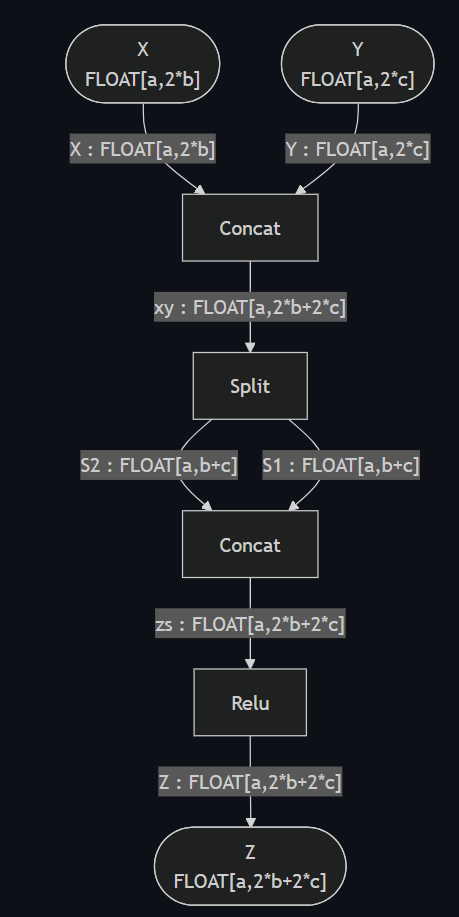

Core pieces: take what you need
+++++++++++++++++++++++++++++++

The C++ code ships as small libraries so downstream projects link only what
they need:

- parse and serialize, no schema needed (1.5 Mb),
- existing C++ ONNX library, no change (5 Mb),
- light schema (2 Mb, not loaded as a static variable),
- graph manipulations (0.6 Mb),
- new shape inference (1.5 Mb),
- C++ kernels (4.8 Mb),
- 2000+ C++ backend tests (7 Mb).

Parsing and serializing options
+++++++++++++++++++++++++++++++

- data can be aligned when loading a tensor,
- parallelization is possible,
- :epkg:`onnxruntime` :epkg:`FlatBuffers` format is supported,
- more secure: recursion is limited,
- other scenarios can be implemented, such as a callback to allocate directly
  on GPU or any other memory.

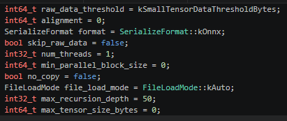

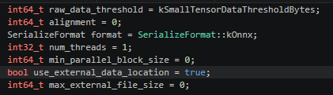

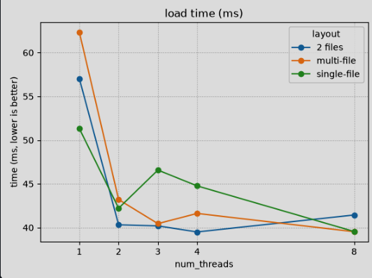

Kernels
+++++++

Kernels are kept simple, with a dispatch mechanism to support all types.

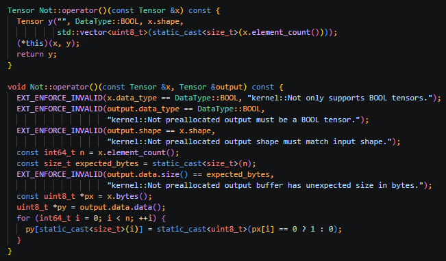

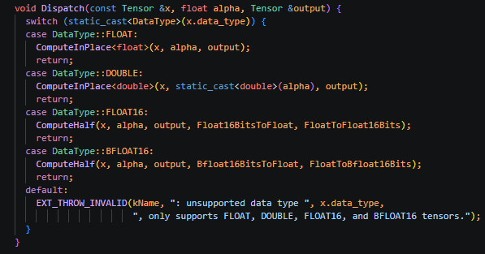

Backend tests
+++++++++++++

They are very similar to the existing ones, except they do not write any
file.

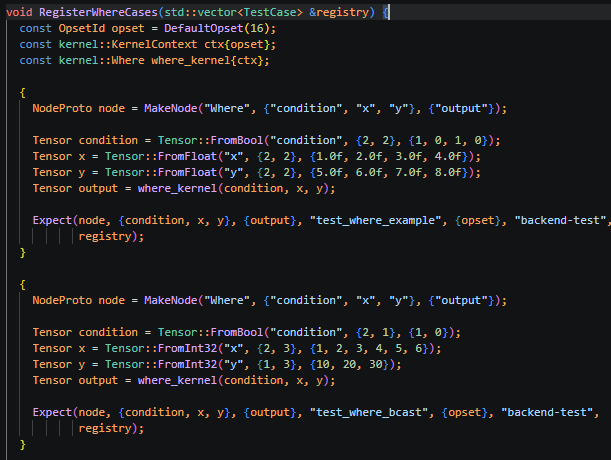

Running models
++++++++++++++

The kernels are more than a way to produce the expected outputs of the
backend tests: together they form a self-contained C++ **reference runtime**
for the ONNX operator set. A model can be evaluated in C++ (or from Python)
without pulling in a third-party runtime. The runtime exposes a
``RuntimeSession`` that parses a model once, builds an execution plan and
can then be run repeatedly on runtime ``Tensor`` inputs, which avoids rebuilding
the plan on every call. See :ref:`l-design-runtime` for the design and
:ref:`l-example-plot-abs-benchmark` for a benchmark comparing ``onnx-light``
with :epkg:`onnxruntime`.

Graph optimization
++++++++++++++++++

``onnx-light`` optimizes a model by repeatedly matching small
:class:`~onnx_light.onnx_core.optimization.PatternOptimization` subgraphs and
replacing them with a simplified equivalent (removing useless ``Cast`` nodes,
consecutive ``Neg``, ...). Patterns are implemented in C++ and registered into a
shared dispatch table so a downstream project can add its own. Every applied
rewrite is recorded and can be replayed from the original model. See
:ref:`l-example-plot-pattern-optimization` for the workflow and
:ref:`l-howto-add-custom-pattern` for writing a custom pattern.

Gradients
+++++++++

Gradients of an ONNX graph can be computed and used to train a model. See
:ref:`l-example-gradient-linear-regression` for a linear-regression example.

Encrypted save / load
+++++++++++++++++++++

Models can be encrypted with AES-256-CBC (``ONNXCRY1``) or ChaCha20-Poly1305
(``ONNXCRY2``), both using PBKDF2-HMAC-SHA256 key derivation, and saved to a
single self-contained ``.onnxc`` file or serialized to an in-memory ``bytes``
object.

Shape inference tests
+++++++++++++++++++++

New tests are dedicated to shape inference: ``value_info`` is filled with the
expected values.

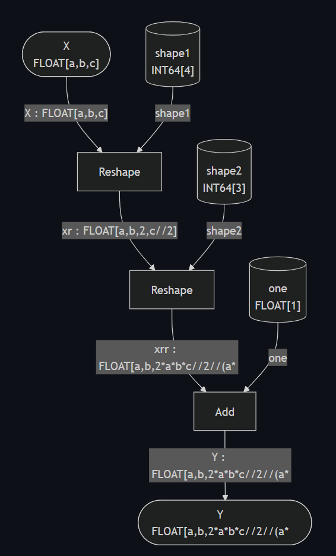

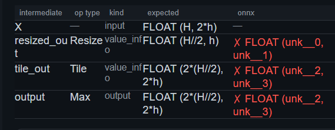

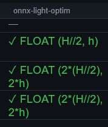

Symbolic expressions
++++++++++++++++++++

Expressions only use symbols, with no function calls, to keep them short.
There are two divisions:

- ``//`` rounds the result,
- ``/:`` is used when the exact result is known to be an integer.

For example, ``Reshape(x[N], [-1, 2])`` tells us ``N`` is even, so we write
``N /: 2`` and not ``N // 2``: ``2 * (N /: 2) == N`` while ``2 * (N // 2)``
may differ.

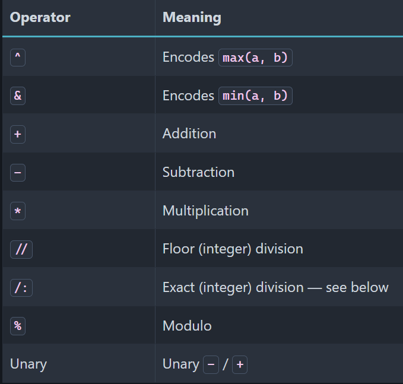

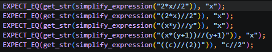

Next steps
++++++++++

Several of the original goals are now implemented: a C++ reference runtime,
graph-rewriting optimizations, gradient computation, encrypted save / load and
the :epkg:`onnxruntime` :epkg:`FlatBuffers` format. Compatibility with ``ir-py``
and with the standard ``onnx`` API is checked continuously in CI. Work still in
progress and under discussion is tracked in :ref:`l-next-steps`, and includes:

- extending the runtime with session execution pools and prepared execution,
- quantization and custom tensor types,
- more graph transformations and model-resolution scenarios.
